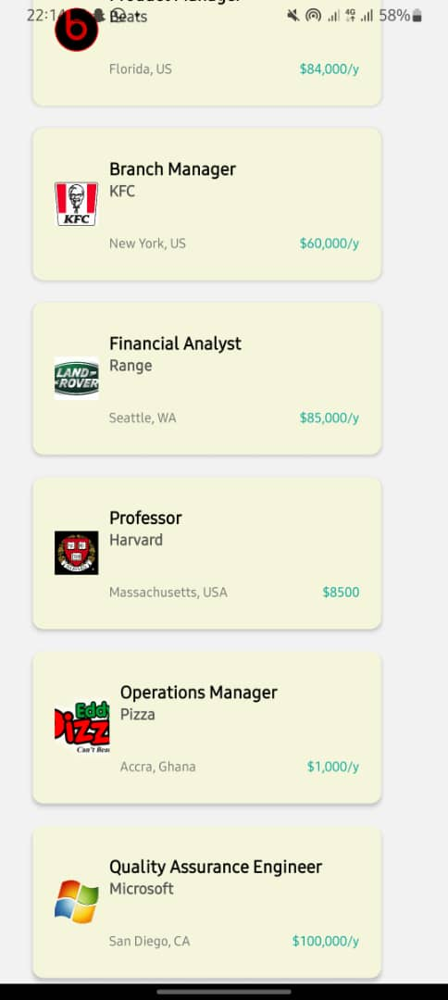

# rn-assignment4-11117479

This project consists of several components that work together to create a job search application. Here's a brief overview of each component:

1. Login Component:
   a. Handles user login functionality.
   b.Allows users to input their name and email.
   c.Validates input before navigating to the Home screen.
   d.Provides options to log in with different social media platforms.

2. Home Component:
   A.Displays after successful login.
   B.Shows user information (name and email) from the Login screen.
   C.Features a search bar for searching jobs.
   D. Lists featured and popular job cards horizontally and vertically.

3. JobCard Component:
   A.Represents individual job listings.
   B.Displays job title, company, location, and salary.
   C.Uses company logos fetched from local assets.
   D.Supports customizable styles for different job listings.

4. FeaturedJobs and PopularJobs Data:
   A.Arrays containing mock data for featured and popular job listings.
   B.Each job listing includes details such as company, title, location, salary, and styling options.

5. Navigation (App Component):
   A.Sets up navigation using `react-navigation` library.
   B.Handles navigation between Login and Home screens using a stack navigator.
   C.Initializes the app with the Login screen as the initial route.

6. Assets:
   \*Contains images used in the app, such as company logos and decorative images.

7. Styling:
   A.Uses StyleSheet from `react-native` for consistent UI across components.
   B.Defines styles for text, inputs, buttons, containers, and job cards.

FUNCTIONALITY
Login Flow: Users can log in with their name and email.
Navigation: Users move from the Login screen to the Home screen upon successful login.
Job Listing: Displays job listings with details fetched from data arrays.
Search: Provides a search bar for finding specific jobs.

Technologies Used
A.React Native
B.React Navigation
C.Native Stack Navigator
D.JSX for component rendering
E.Local assets for images

This app demonstrates basic navigation, data handling, and UI design principles in React Native, tailored for a job search application.

SCREENSHOTS

